# Sentiment Analysis 

This section focuses on various NLP methods to perform sentiment analysis; and the 'mxnet' folder considers a deep-learning approach. The topics covered are:

1. Term Frequency 
2. Word Vectors
3. Recurrent Neural Networks
4. Paragraph Vectors
5. Character-level Convolutional Neural Networks

## Data Citation:

The methods here use Amazon data from the below source:

```
Image-based recommendations on styles and substitutes
J. McAuley, C. Targett, J. Shi, A. van den Hengel
SIGIR, 2015

Inferring networks of substitutable and complementary products
J. McAuley, R. Pandey, J. Leskovec
Knowledge Discovery and Data Mining, 2015
```

## Diagrams:

The non-deep learning section focuses on ways of representing the X tensor - how to feed text into a classifer, and so the representation rather than the 'brain' of the model. The deep-learning section uses a CNN which automatically calculates the brain and the feature-extraction from text on a character level. 

Some pictures to illustrate from the slides:

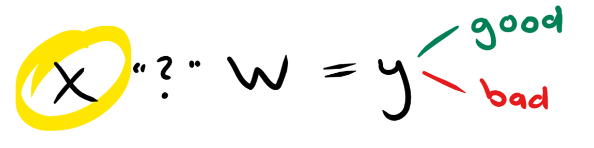
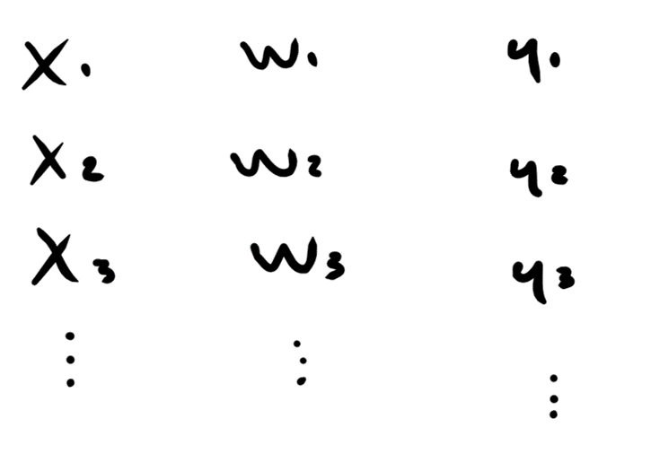
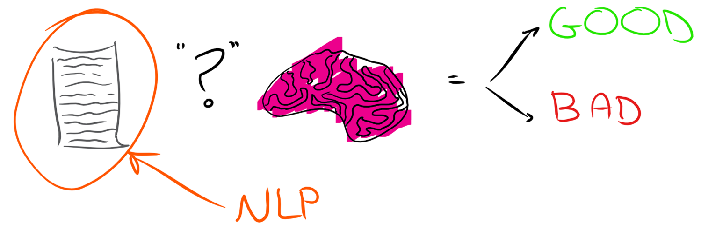
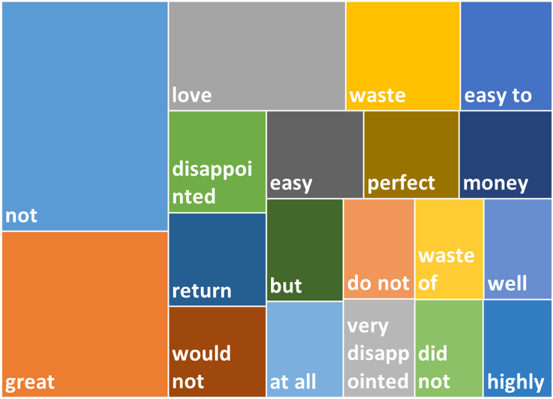
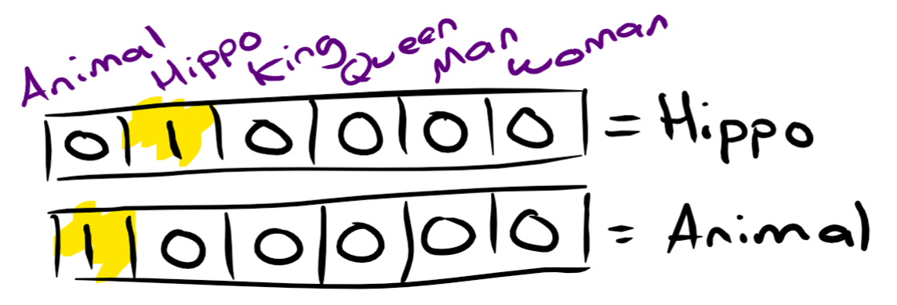
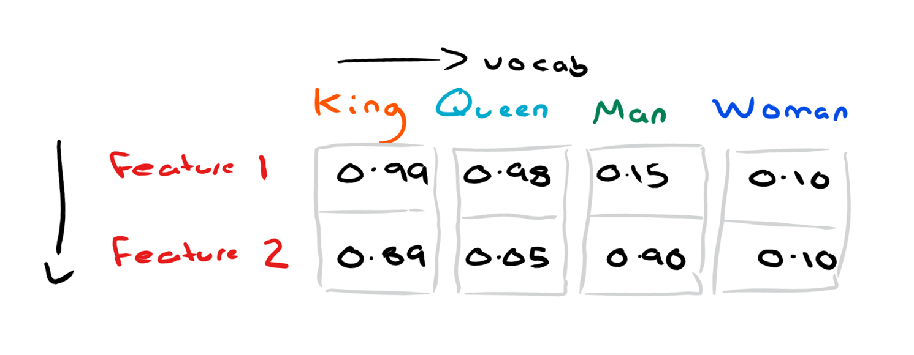
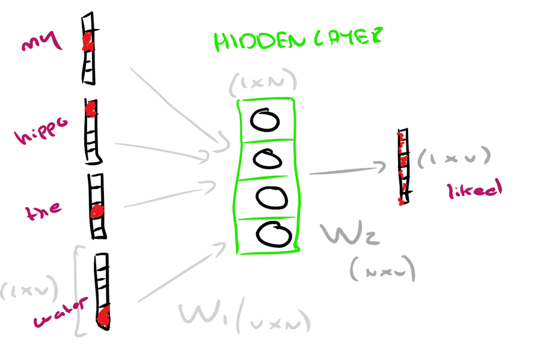
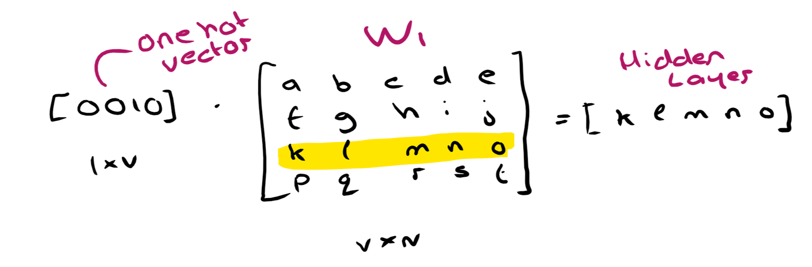

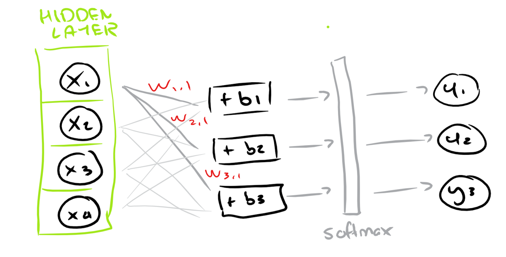
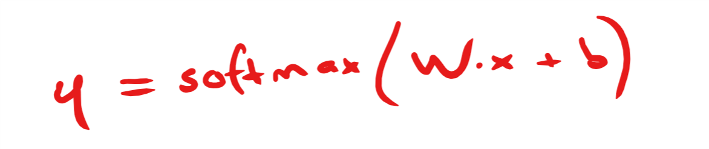
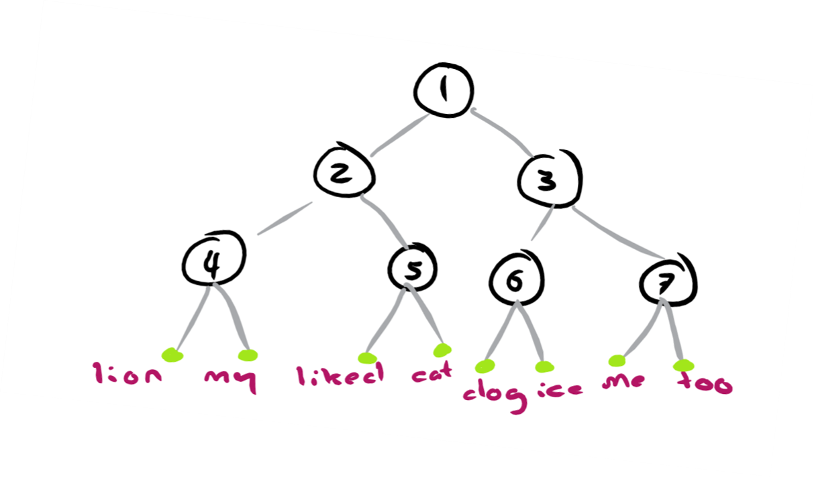
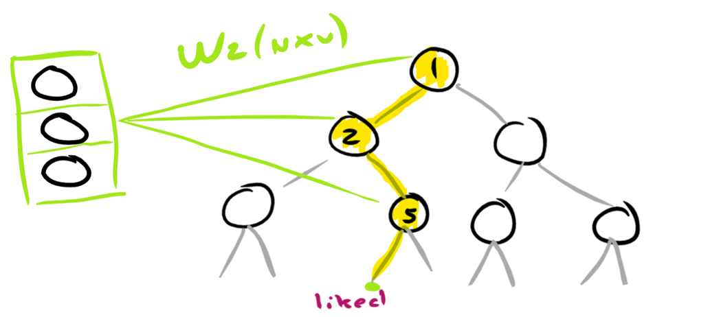
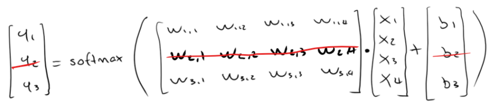
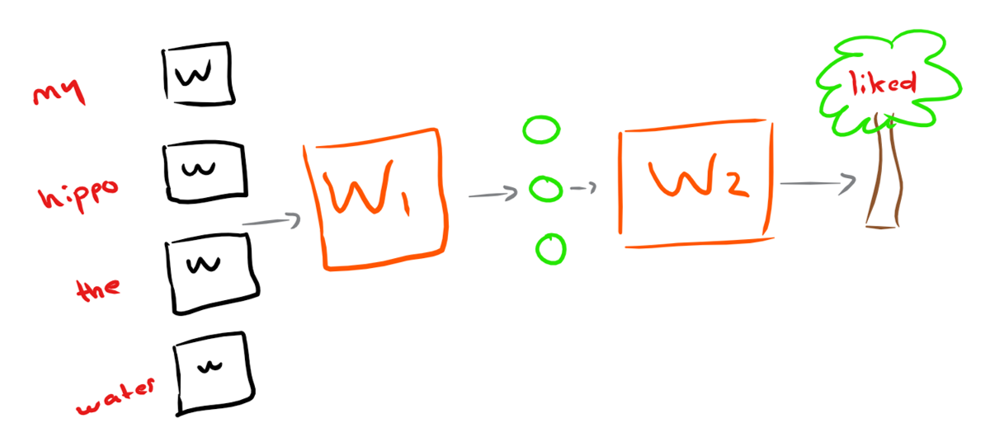
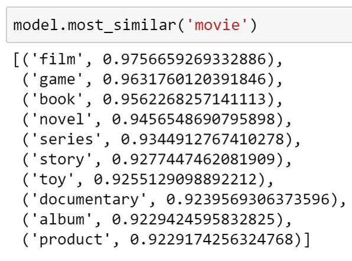
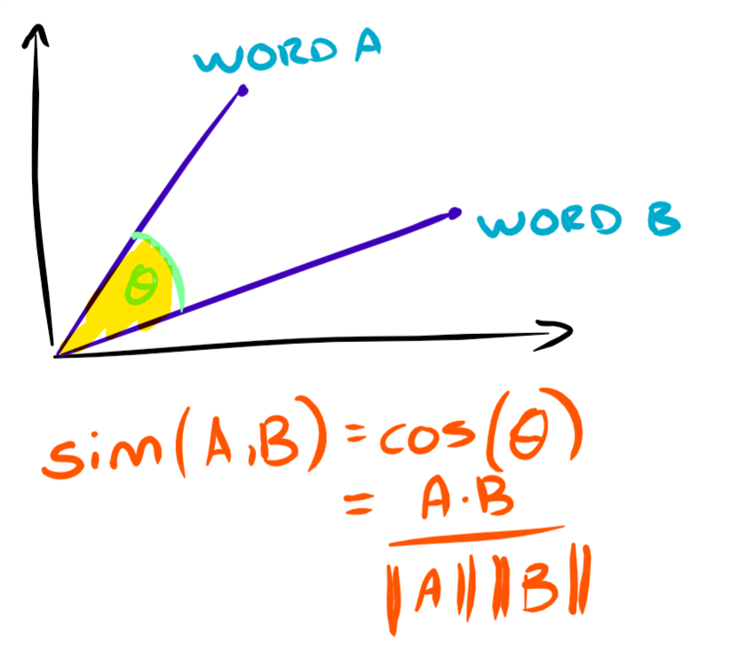
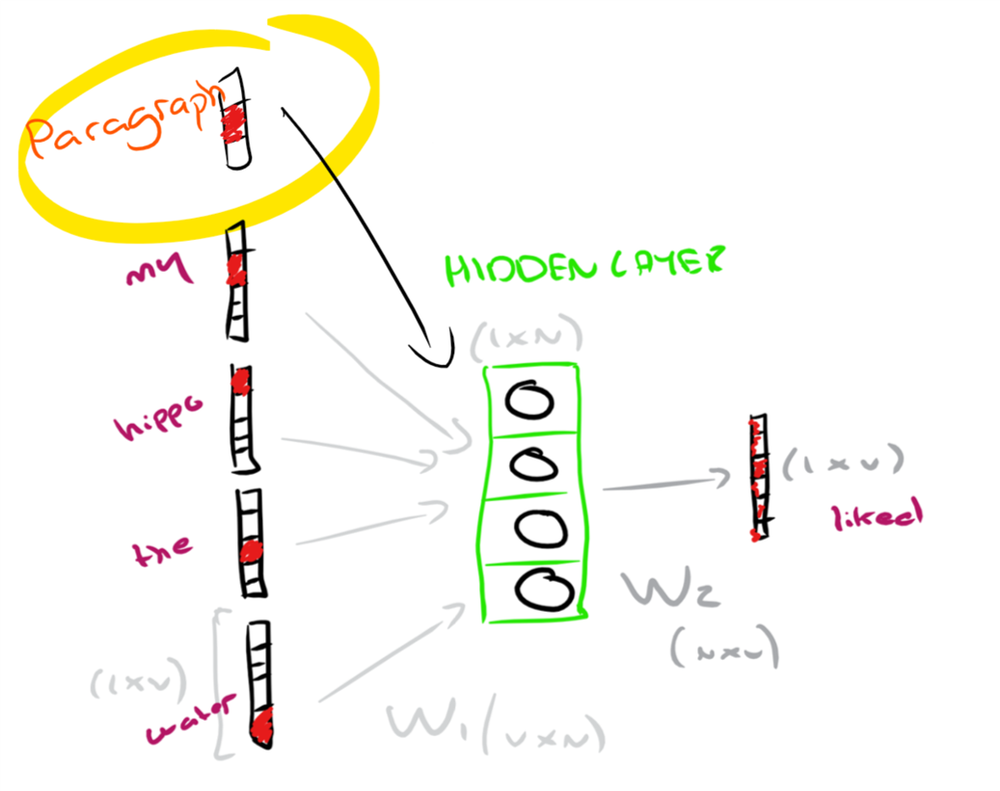

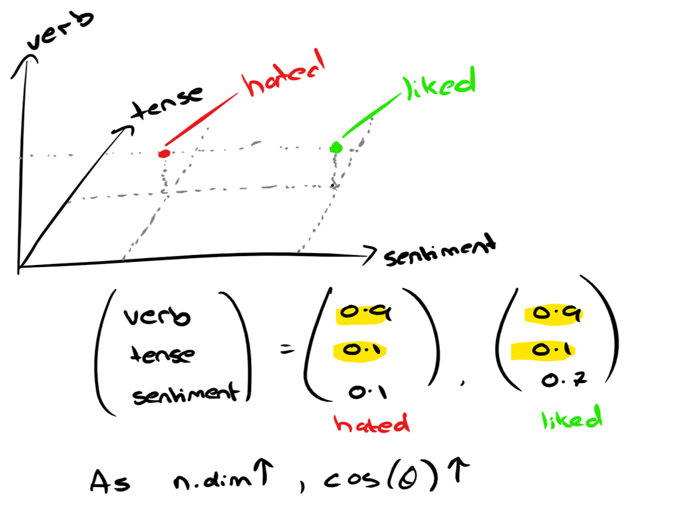
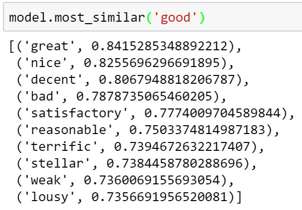
