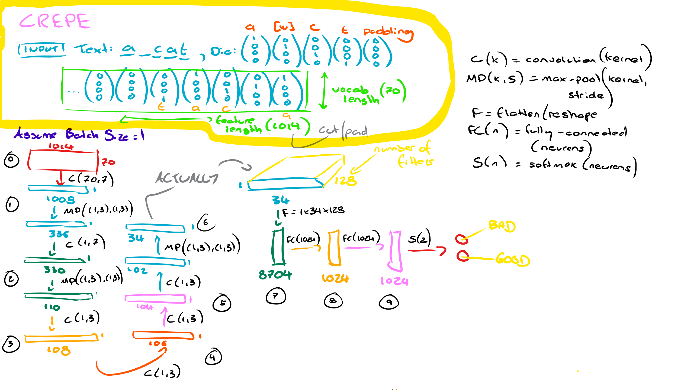
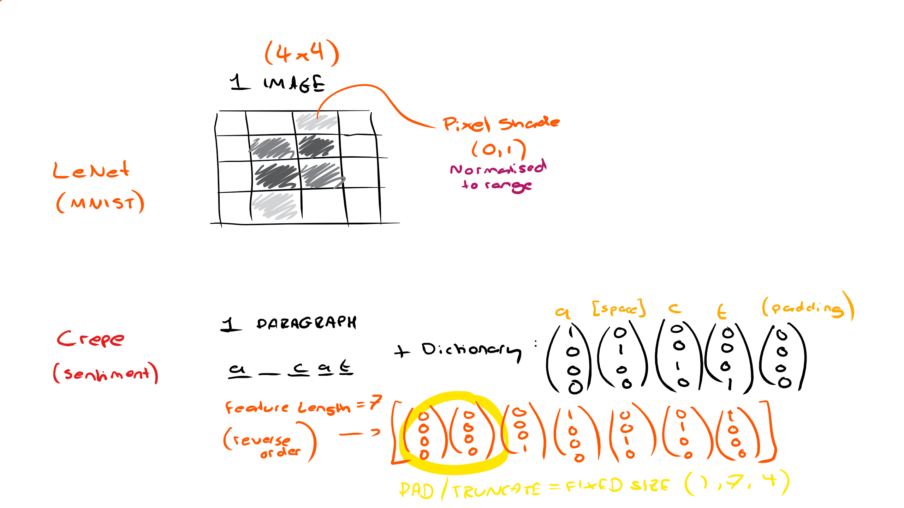
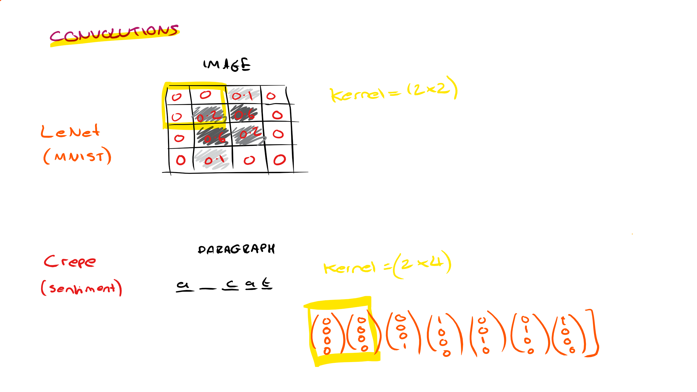
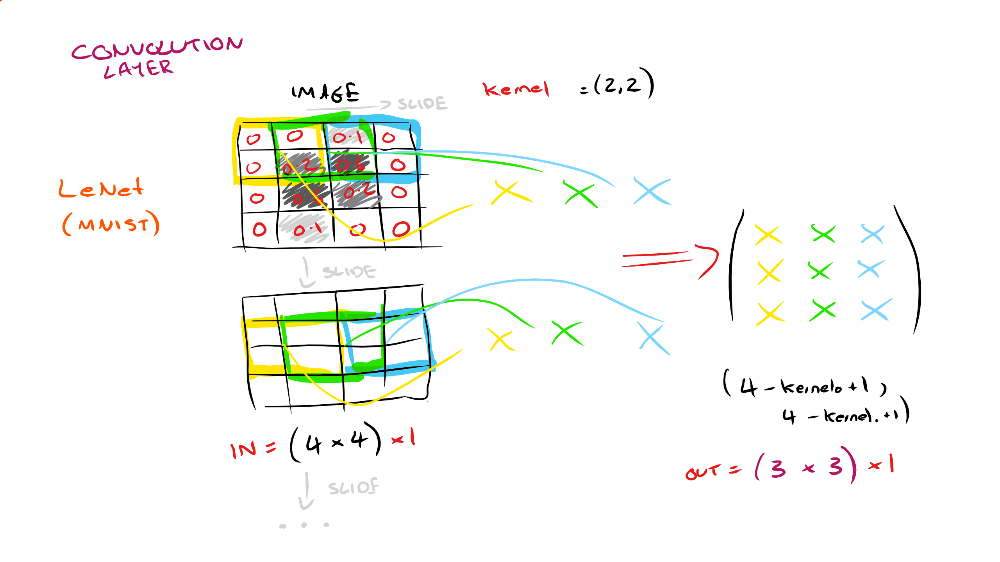
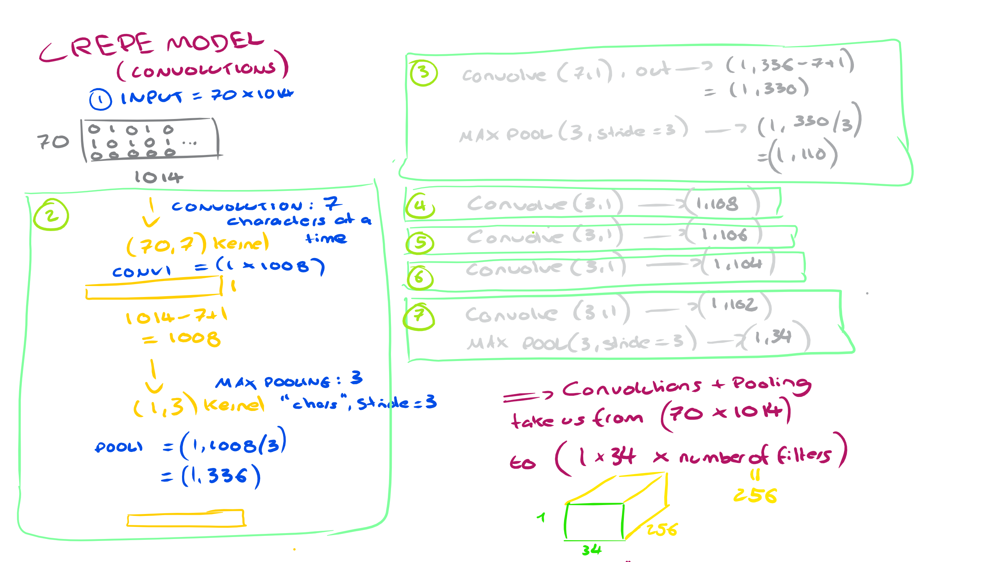
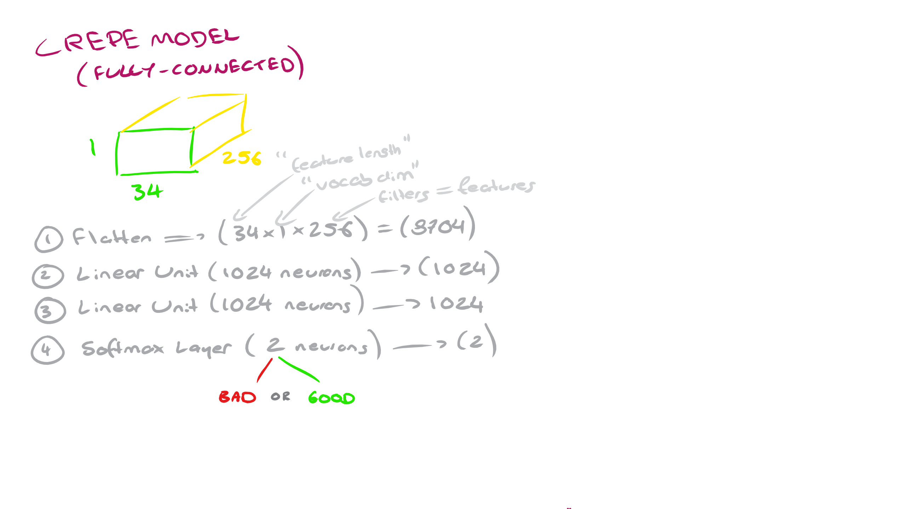

# Deep Learning - Sentiment Analysis using MXNet

## LeNet - MNIST

This notebook walks through different ways of creating and fitting a CNN - ranging from high-level APIs to low-level APIs which give more control over various parameters of the model, along with stuff like custom generators that read from disk, etc.

This is not a sentiment analysis task but it goes over the mnist frameworks we use for sentiment analysis

## Sentiment Analysis - CREPE model

The first convolutional block of the crepe model uses a kernel of size (dim(vocab), 7), perhaps because the average word is 7 characters - this creates a layer wich contains 1018 representations of 'words' (linked by a sliding window of 7 characters) and so the next max-pooling layer with a kernel of (1, 3) and a stride of (1, 3) can be loosely interpreted as a trigram approach. After this we see various layers to perform analysis at greater levels of aggregation (to introduce wider context) before we output with a standard softmax layer.



We use a char-level CNN to classify amazon reviews, called the [Crepe model](https://github.com/zhangxiangxiao/Crepe) and attempt to improve upon the non-deep-learning methods earlier to replicate [Ziang's accuracy of 94.50% (100% - 5.50%)](http://arxiv.org/abs/1509.01626)

```Xiang Zhang, Junbo Zhao, Yann LeCun. Character-level Convolutional Networks for Text Classification. Advances in Neural Information Processing Systems 28 (NIPS 2015)```

## Description:

The below diagrams illustrate how we extend the traditional LeNet CNN applied to MNIST to characters:






